<div align="right">
    
</div>

# TP

## Información del estudiante

* Nombre y Apellido: Lucas Roda
* Padrón: 114402
* Mail: lroda@fi.uba.ar
* Username de GitHub: LucasRodaFiuba

## Índice
* [1. Instrucciones](#1-Instrucciones)
  * [1.1. Compilar el proyecto](#11-Compilar-el-proyecto)
  * [1.2. Ejecutar las pruebas](#12-Ejecutar-las-pruebas)
  * [1.3. Ejecutar el programa con Valgrind](#13-Ejecutar-el-programa-con-Valgrind)
* [2. Funcionamiento](#2-Funcionamiento)
* [3. Estructura](#3-Estructura)
  * [3.1. Diagrama de memoria](#31-Diagrama-de-memoria)
  * [3.2. Análisis de complejidades](#32-Análisis-de-complejidades)
* [4. Decisiones de diseño y/o complejidades de implementación](#4-Decisiones-de-diseño-yo-complejidades-de-implementación)
* [5. Respuestas a las preguntas teóricas](#5-Respuestas-a-las-preguntas-teóricas)

## 1. Instrucciones

> [!NOTE]
> Las siguientes instrucciones de compilación y prueba mediante el `Makefile` están pensadas para ejecutarse en un entorno basado en Linux (como WSL o Ubuntu), donde se encuentran instaladas las herramientas `build-essential` (`gcc`, `make`) y `valgrind`.

### 1.1. Compilar el proyecto

```bash
make build
```
### 1.2. Ejecutar las pruebas

```bash
make test
```

### 1.3. Ejecutar el programa con Valgrind
Para verificar la ausencia de fugas de memoria y accesos inválidos:
```bash
make valgrind
```

## 2. Funcionamiento
El programa principal evalúa expresiones matemáticas en Notación Polaca Inversa (RPN) recibidas a través de la línea de comandos. Para lograr esto, procesa secuencialmente cada argumento ingresado utilizando el TDA Pila para almacenar temporalmente los operandos.

Cuando se ingresa un número, este se convierte a entero y se apila. Al encontrar un operador aritmético (`+`, `-`, `*`, `/`), se desapilan los dos últimos operandos, se efectúa la operación correspondiente y el resultado se vuelve a apilar. Si durante el proceso se detecta un error de sintaxis (falta de operandos, tokens inválidos, división por cero o un número final de elementos distinto de uno), el programa imprime `ERROR` por pantalla y finaliza liberando toda la memoria reservada. Si la expresión es válida, imprime el resultado final.

<div align="center">
  
  <p>Diagrama de flujo del programa explicado con más detalle.</p>
</div>

## 3. Estructura
- TDA Lista: Es una lista simplemente enlazada representada por una estructura principal lista_t que mantiene un contador cantidad de elementos y dos referencias clave: primer_nodo y ultimo_nodo. Cada nodo (nodo_t) contiene un puntero genérico void * al dato almacenado y un puntero siguiente que apunta al nodo contiguo.
- TDA Pila: Se implementó reutilizando internamente la estructura lista_t (wrapper). Al apilar y desapilar únicamente por la cabeza/inicio de la lista, se logra la disciplina de acceso LIFO (Last In, First Out).
- TDA Cola: Se implementó reutilizando internamente la estructura lista_t (wrapper). Al encolar al final (usando el puntero ultimo_nodo) y desencolar al inicio, se garantiza la disciplina FIFO (First In, First Out).

### 3.1 Diagrama de memoria

El siguiente diagrama muestra la distribución de la memoria (Stack y Heap) durante la ejecución del programa con una lista simplemente enlazada de dos elementos:

* En el **Stack** reside el puntero a la estructura principal.
* En el **Heap** se alojan dinámicamente la estructura cabecera (`lista_t`), los nodos enlazados (`nodo_t`) y los datos apuntados por los elementos. La cabecera mantiene referencias directas en $O(1)$ al `primer_nodo` y al `ultimo_nodo`[cite: 3].

<div align="center">
  
  <p>Diagrama de memoria que ilustra la estructura en el Stack y el Heap.</p>
</div>

### 3.2. Análisis de complejidades

| Función | Complejidad | Justificación |
| :--- | :---: | :--- |
| `lista_crear` | $O(1)$ | Asigna dinámicamente el bloque de memoria de la cabecera mediante `calloc`. |
| `lista_esta_vacia` / `lista_vacia` | $O(1)$ | Verifica si el puntero es `NULL` o si la cantidad de elementos es igual a 0. |
| `lista_cantidad` | $O(1)$ | Consulta directamente el campo `cantidad` guardado en la estructura. |
| `lista_insertar` (extremos) | $O(1)$ | Al insertar en posición 0 o al final, utiliza los punteros directos `primer_nodo` y `ultimo_nodo` sin recorrer la lista. |
| `lista_insertar` (medio) | $O(n)$ | En el peor caso debe avanzar nodo a nodo hasta la posición $n-1$. |
| `lista_eliminar` (inicio) | $O(1)$ | Desengancha y reconecta directamente el puntero `primer_nodo`. |
| `lista_eliminar` (medio/fin) | $O(n)$ | Requiere recorrer secuencialmente hasta el nodo anterior al que se desea eliminar. |
| `lista_obtener` / `lista_reemplazar` | $O(n)$ | Avanza elemento por elemento, salvo en la última posición donde se accede en $O(1)$ vía `ultimo_nodo`. |
| `lista_buscar` | $O(n)$ | Aplica la función comparadora recorriendo secuencialmente todos los nodos hasta hallar coincidencia o llegar al final. |
| `lista_destruir` | $O(n)$ | Recorre y libera dinámicamente uno a uno los $n$ nodos de la lista antes de liberar la cabecera. |
| `lista_destruir_todo` | $O(n)$ | Recorre los $n$ nodos, aplicando la función destructora dada por parámetro a cada elemento antes de liberar el nodo. |
| `lista_con_cada_elemento` / `lista_iterar` | $O(n)$ | Aplica la función callback a cada uno de los $n$ elementos o hasta que la función devuelva `false`. |
| `lista_iterador_crear` / `lista_iterador_destruir` | $O(1)$ | Asigna o libera únicamente la estructura receptora del iterador externo. |
| `lista_iterador_avanzar` / `lista_iterador_siguiente` | $O(1)$ | Avanza la referencia del puntero `corriente` al nodo siguiente. |
| `lista_iterador_actual` / `lista_iterador_obtener_elemento` | $O(1)$ | Retorna el puntero al elemento guardado en el nodo `corriente`. |
| `lista_iterador_hay_mas_elementos` / `lista_iterador_se_puede_iterar` | $O(1)$ | Evalúa si el puntero `corriente` es distinto de `NULL`. |
| `pila_crear` | $O(1)$ | Asigna memoria para la estructura de la pila y delega la creación de la lista subyacente en `lista_crear`. |
| `pila_esta_vacia` | $O(1)$ | Delega la verificación en `lista_cantidad` / `lista_esta_vacia` de la lista interna. |
| `pila_cantidad` | $O(1)$ | Retorna la cantidad de elementos invocando `lista_cantidad` en $O(1)$. |
| `pila_apilar` | $O(1)$ | Inserta el elemento en la posición 0 de la lista enlazada subyacente. |
| `pila_desapilar` | $O(1)$ | Elimina y retorna el elemento en la posición 0 de la lista subyacente. |
| `pila_tope` | $O(1)$ | Obtiene el elemento en la posición 0 de la lista subyacente. |
| `pila_destruir` | $O(n)$ | Invoca `lista_destruir` para liberar los nodos y luego libera la estructura contenedora. |
| `pila_destruir_todo` | $O(n)$ | Invoca `lista_destruir_todo` con el destructor dado y libera la estructura contenedora. |
| `cola_crear` | $O(1)$ | Asigna memoria para la estructura de la cola y delega la creación en `lista_crear`. |
| `cola_esta_vacia` | $O(1)$ | Delega la verificación en `lista_cantidad` / `lista_esta_vacia` de la lista interna. |
| `cola_cantidad` | $O(1)$ | Retorna la cantidad de elementos invocando `lista_cantidad` en $O(1)$. |
| `cola_encolar` | $O(1)$ | Inserta el elemento al final de la lista subyacente aprovechando el puntero al último nodo. |
| `cola_desencolar` | $O(1)$ | Elimina y retorna el elemento en la posición 0 (frente) de la lista subyacente. |
| `cola_frente` | $O(1)$ | Obtiene el elemento en la posición 0 (frente) de la lista subyacente. |
| `cola_destruir` | $O(n)$ | Invoca `lista_destruir` para liberar los nodos y luego libera la estructura contenedora. |
| `cola_destruir_todo` | $O(n)$ | Invoca `lista_destruir_todo` con el destructor dado y libera la estructura contenedora. |

## 4. Decisiones de diseño y/o complejidades de implementación
La mayor complejidad técnica residió en lograr que las primitivas de Pila y Cola operen en tiempo constante $O(1)$ reutilizando la lista simplemente enlazada. Para lograr que cola_encolar cumpla con $O(1)$, la lista mantiene explícitamente un puntero ultimo_nodo que se actualiza en cada inserción o eliminación relevante.
Por otro lado, para garantizar compatibilidad total con C99 estricto (-std=c99 -pedantic), se decidió no recurrir a funciones fuera del estándar como strdup y en su lugar se implementó la función auxiliar mi_strdup para el duplicado de cadenas al parsear vectores en main.c.

## 5. Respuestas a las preguntas teóricas

### 5.1 Explicar qué es una lista, lista enlazada y lista doblemente enlazada.
Una lista es un tipo de dato abstracto que esta compuesto por una agrupación de elementos, en la cual cada uno tiene un sucesor (exceptuando el ultimo elemento de la lista) y un predecesor (exceptuando el primer elemento de la lista).
Lista Simplemente Enlazada: Colección de nodos dispersos en memoria unidos mediante un enlace unidireccional siguiente.   
- Ventajas: Altamente flexible; insertar o borrar en los extremos es $O(1)$ sin mover datos en memoria.   
- Desventajas: Se pierde el acceso directo por índice ($O(n)$) y requiere overhead de memoria por guardar los punteros.   
Lista Doblemente Enlazada: Cada nodo contiene dos referencias: siguiente y anterior.
- Diferencia interna: Permite recorridos en ambos sentidos y borrar un nodo conocido en $O(1)$.
- Desventaja: Ocupa más espacio en memoria por nodo (dos punteros) y requiere actualizar más referencias en cada operación.
### 5.2 Explicar qué es una lista circular y de qué maneras se puede implementar.
Una lista circular es aquella en la cual el último nodo no apunta a NULL, sino que su puntero siguiente vuelve a referenciar al primer nodo de la secuencia.Maneras de implementación:Simplemente enlazada circular: El último nodo referencia a la cabeza.Doblemente enlazada circular: El siguiente del último apunta al primero, y el anterior del primero apunta al último.Con puntero a la cola: Manteniendo únicamente un puntero al último nodo, se puede acceder tanto al final como al inicio (tail->siguiente) en $O(1)$.
### 5.3 Explicar la diferencia de funcionamiento entre cola y pila.
- Pila (LIFO - Last In, First Out): El último elemento ingresado es el primero en ser retirado. Todas las operaciones (apilar, desapilar, tope) se realizan sobre un único extremo denominado "tope".  
- Cola (FIFO - First In, First Out): El primer elemento ingresado es el primero en ser retirado. Sus operaciones trabajan en extremos opuestos: las inserciones se hacen por el "final" y las extracciones por el "frente".  
### 5.4 Explicar la diferencia entre un iterador interno y uno externo.
- Iterador Interno: La propia estructura gestiona el recorrido mediante una función lista_iterar que recibe una función de callback y un puntero de contexto. El usuario define la acción sobre cada elemento, y la iteración se detiene si la función retorna false.
- Iterador Externo: Es una estructura independiente (lista_iterador_t) que almacena el estado actual del recorrido (corriente). Le permite al usuario controlar cuándo avanzar (siguiente), verificar si restan elementos o pedir el dato actual según la lógica de su propio código.